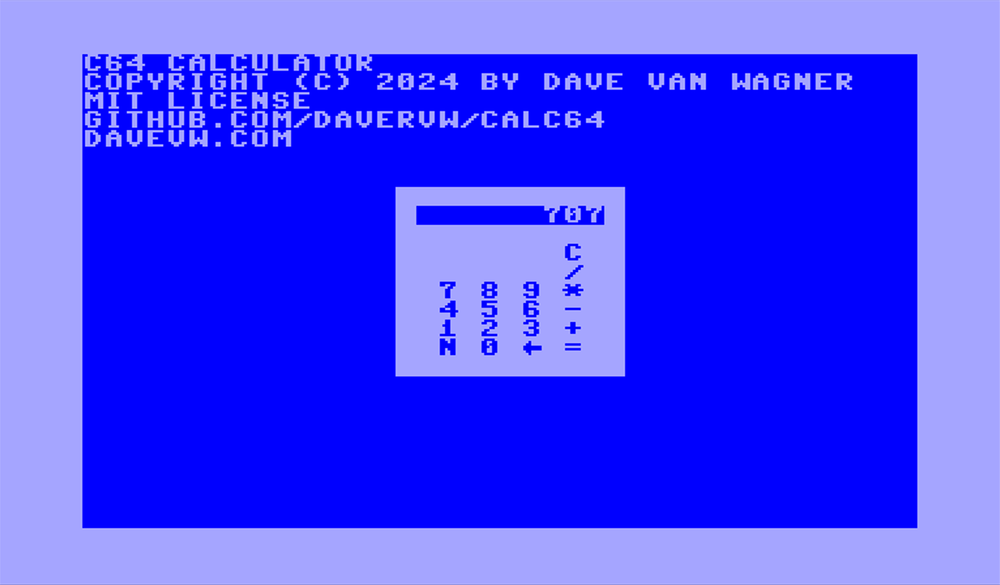

# Calc64 #

Commodore Calculator for Commodore 64, PET, 128, 16, Plus/4, etc.

This is an example calculator program including operator precedence.  Use is like a handheld calculator.  Keys are shown on screen.  Works in 40 and 80 column screens.  A few manual edits to adjust screen use (lines 1-9) and it will work on Vic-20 as well!   Only works with integers at this time.  It is intended to be upgraded.

Instructions

````
LOAD"CALC64",8
RUN
````

Use ``STOP`` to quit



Link: [blog entry](https://techwithdave.davevw.com/2024/02/calculator-for-commodore-64-and-other.html)
